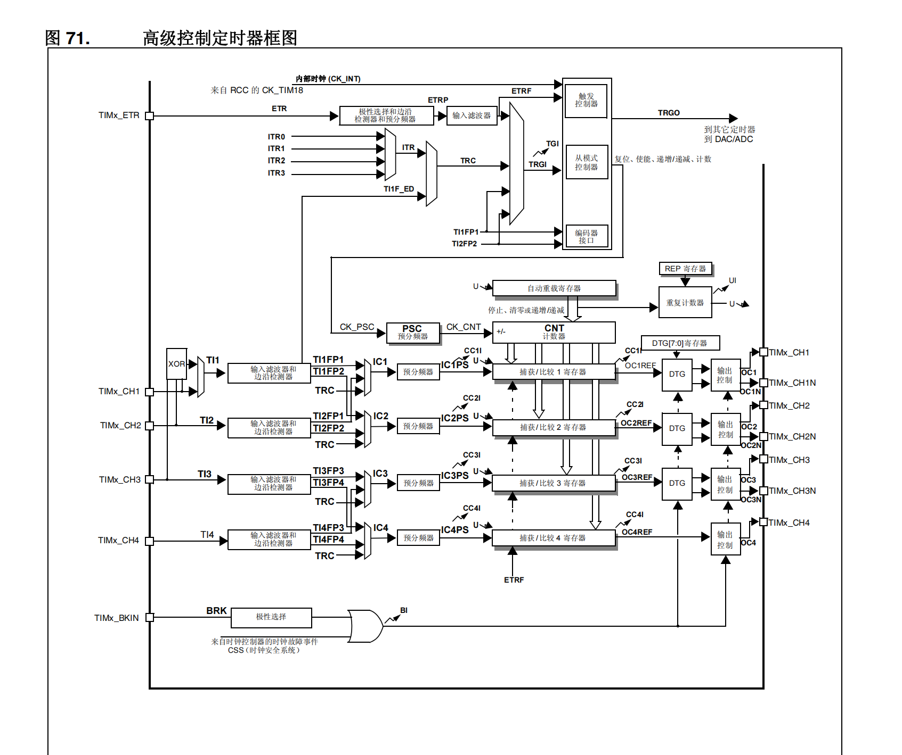

# low power mode例程

通过一个简单的应用实例学习PWR和TIM。

## 基础

### TIM



参考手册中TIM的介绍如下：

> 自动重载寄存器是预装载的。对自动重载寄存器执行写入或读取操作时会访问预装载寄存器。预装载寄存器的内容既可以直接传送到影子寄存器，也可以在每次发生更新事件 (UEV)时传送到影子寄存器，这取决于 TIMx_CR1 寄存器中的自动重载预装载使能位 (ARPE)。当计数器达到上溢值（或者在递减计数时达到下溢值）并且 TIMx_CR1 寄存器中的 UDIS 位为0 时，将发送更新事件。该更新事件也可由软件产生。
> 

以下面的配置为例进行分析：


STM32F103系统时钟的72MHz会经过预分频器PSC进行(7199+1)分频，到计数器的频率是10000MHz了，定时器的寄存器实际写入的值都要减一，因为定时器的工作原理是从0开始算的，实际计数次数要加一。

预分频器设为7199，STM32F103系统时钟到CNT的时钟频率是10000Hz了。自动重装载寄存器值设为999、计数模式设为向下计数，那么CNT每次下溢的周期就是1/10s。重复计数器的值是9，因此CNT重复下溢10次才会产生更新中断，所以最终就是1s产生一次update中断。

## 配置

例程中打开了串口方便输出调试信息，打开串口中断，当串口助手发送数据到单片机，会通过中断唤醒睡眠中的单片机，并且串口中断中会修改系统工作周期。


再开启TIM1，用于设置系统工作周期，当定时器计时溢出中断后，会唤醒单片机进行工作，工作完成后再进入休眠模式。


## Sleep模式

睡眠模式有WFI（中断唤醒）和WFE（时间唤醒），这里使用WFI就够了。仿造实际应用场景，编写了一个简单程序。单片机采用状态机模型。

首先会进入idle状态，先挂起SysTick，避免被SysTick在一毫秒内唤醒了，然后进入了休眠模式。

系统初始化时会设置开启定时器，在定时器溢出后产生update中断，通过`HAL_TIM_PeriodElapsedCallback` 回调函数设置系统状态机为work，让他执行对应的工作。同时，update中断会唤醒idle状态下休眠的系统，继续往下执行，在下一次循环中就会执行到work状态，做对应的工作。

如果通过串口发送一个字节，会进入串口中断。在串口接收回调函数中接收一个字节的命令，然后根据这个命令设置定时器的ARR寄存器，来设置系统的运行周期。在主函数中，由于串口接收中断没有改变系统状态，所以修改完TIM周期后，还是会继续进入idle状态去休眠。

```c
/* Private typedef -----------------------------------------------------------*/
/* USER CODE BEGIN PTD */
enum system_state
{
  STATE_IDLE = 0,
  STATE_WORK,
  STATE_STOP
};
typedef enum system_state system_state_t;
/* USER CODE END PTD */

/* Private define ------------------------------------------------------------*/
/* USER CODE BEGIN PD */
/* USER CODE END PD */

/* Private macro -------------------------------------------------------------*/
/* USER CODE BEGIN PM */

/* USER CODE END PM */

/* Private variables ---------------------------------------------------------*/

/* USER CODE BEGIN PV */
char cmd = 0;
system_state_t state = STATE_IDLE;
uint32_t work = 1000;
/* USER CODE END PV */

/* Private function prototypes -----------------------------------------------*/
void SystemClock_Config(void);
/* USER CODE BEGIN PFP */

/* USER CODE END PFP */

/* Private user code ---------------------------------------------------------*/
/* USER CODE BEGIN 0 */
/**
  * @brief  Period elapsed callback in non blocking mode
  * @param  htim : TIM handle
  * @retval None
  */
void HAL_TIM_PeriodElapsedCallback(TIM_HandleTypeDef *htim)
{
  if (htim->Instance == TIM1)
  {
    state = STATE_WORK;
  }
}
/**
  * @brief  Rx Callback when new data is received on the UART.
  * @param  huart: Uart handle receiving the data.
  * @retval None.
  */
void HAL_UART_RxCpltCallback(UART_HandleTypeDef *huart)
{
  if (huart->Instance == USART1)
  {
    if (cmd > '0' && cmd <= '9')
    {
      // set work time
      work = (uint32_t)(cmd - '0') * 1000 / 2;
      // set run period
      htim1.Instance->ARR = (uint32_t)(cmd - '0') * 1000; // cmd S
      debug_printf("Set period to %d ms\r\n", htim1.Instance->ARR);
    }
  }
  HAL_UART_Receive_IT(&huart1, (uint8_t *)&cmd, 1);
}

int8_t do_work(uint32_t w)
{
  debug_printf("Start work for %d ms\r\n", w);
  HAL_Delay(w);
  debug_printf("Work done\r\n");
  return 0;
}
/* USER CODE END 0 */

/**
  * @brief  The application entry point.
  * @retval int
  */
int main(void)
{
  /* USER CODE BEGIN 1 */
  int8_t result = 0;
  /* USER CODE END 1 */

  /* MCU Configuration--------------------------------------------------------*/

  /* Reset of all peripherals, Initializes the Flash interface and the Systick. */
  HAL_Init();

  /* USER CODE BEGIN Init */

  /* USER CODE END Init */

  /* Configure the system clock */
  SystemClock_Config();

  /* USER CODE BEGIN SysInit */

  /* USER CODE END SysInit */

  /* Initialize all configured peripherals */
  MX_GPIO_Init();
  MX_USART1_UART_Init();
  MX_TIM1_Init();
  /* USER CODE BEGIN 2 */

  /* USER CODE END 2 */

  /* Infinite loop */
  /* USER CODE BEGIN WHILE */
  debug_printf("Power controller test\r\n");
  if(HAL_TIM_Base_Start_IT(&htim1) != HAL_OK)
  {
    debug_printf("Start timer failed\r\n");
    Error_Handler();
  }
  if(HAL_UART_Receive_IT(&huart1, (uint8_t *)&cmd, 1) != HAL_OK)
  {
    debug_printf("Start uart failed\r\n");
    Error_Handler();
  }
  while (1)
  {
    /* USER CODE END WHILE */

    /* USER CODE BEGIN 3 */
    switch (state)
    {
    case STATE_STOP:
      debug_printf("[STOP] Stop work\r\n");
      state = STATE_IDLE;
    case STATE_IDLE:
      debug_printf("[IDLE] Enter sleep mode\r\n");
      /*Suspend Tick increment to prevent wakeup by Systick interrupt. 
      Otherwise the Systick interrupt will wake up the device within 1ms (HAL time base)*/
      HAL_SuspendTick();
      /* Enable Power Control clock */
      __HAL_RCC_PWR_CLK_ENABLE();
      /* Enter Sleep Mode , wake up is done once User push-button is pressed */
      HAL_PWR_EnterSLEEPMode(PWR_MAINREGULATOR_ON, PWR_SLEEPENTRY_WFI);
      /* Resume Tick interrupt if disabled prior to sleep mode entry*/
      HAL_ResumeTick();
      debug_printf("[IDLE] Wake up from sleep mode\r\n");
      break;
    case STATE_WORK:
      debug_printf("[WORK] Do work for %d ms\r\n", work);
      result = do_work(work);
      if(result == 0) // right
      {
        state = STATE_IDLE;
        HAL_TIM_Base_Start_IT(&htim1);
      }
      break;

    default:
      break;
    }
  }
  /* USER CODE END 3 */
}
```